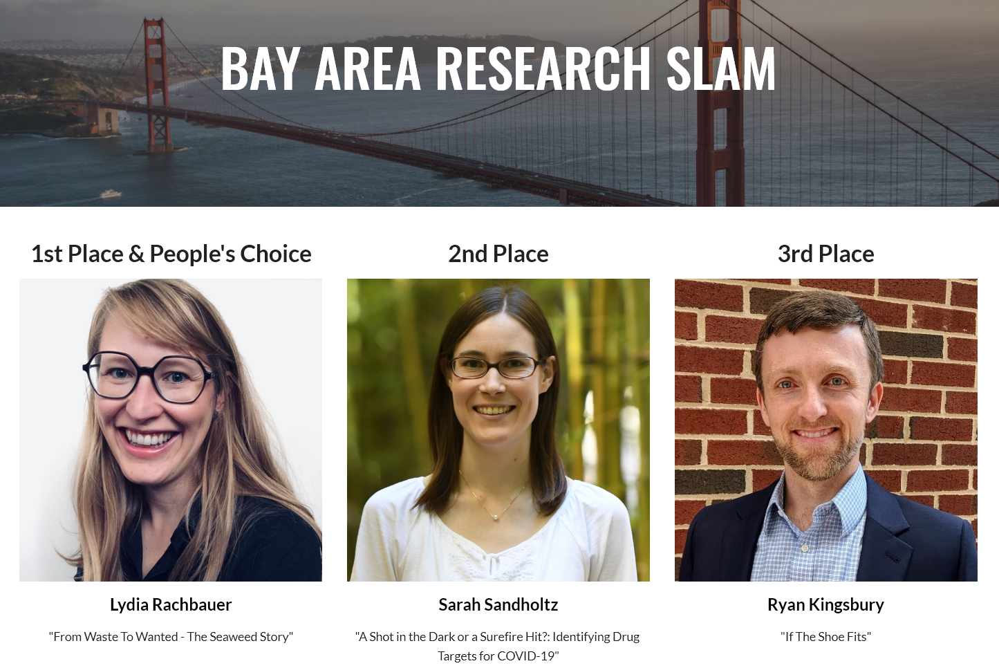

This fall I had the honor of participating in the Research SLAM competition for postdocs. The SLAM challenges contestants to present a compelling three minute presentation of their research in a language appropriate to a non-specialist audience. Due to the COVID-19 pandemic, both competitions took place virtually.

## Berkeley Lab SLAM

In September, I was selected as one of 12 finalists from throughout Berkeley Lab to compete in the [Berkeley Lab Research SLAM](https://slam.lbl.gov/). I was awarded 2nd place and "people's choice" winner for my talk called "If the Shoe Fits." You can watch the full recording of the LBL SLAM [here](https://drive.google.com/file/d/10ID7GU6ytEXUfty-wp5yV8NaqSe1uCdo/view).

## Inaugural Bay Area SLAM

As a top 3 winner at Berkeley, I then advanced to the first-ever [Bay Area Research SLAM](https://sites.google.com/lbl.gov/bay-area-research-slam/home/), where I competed against the top 3 finishers from 3 other Bay Area National Laboratories - Livermore, SLAC, and Sandia. I was thrilled to have the opportunity to present my talk to the Directors of all four of the participating National Labs (who were judging), and won 3rd place overall.

Overall this was a great experience and I was honored to be among the top finishers! The [Career Pathways Office](https://twitter.com/lbnlpathways?lang=en) at Berkeley Lab did a fantastic job organizing and publicizing both events and organizing specialized training session in science communication for us. I also really appreciate the spirit of cooperation among all the postdocs who participated. Between the training sessions and the feedback I got from my peers over several practice rounds, this competition substantially improved my science communication skills.

